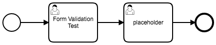
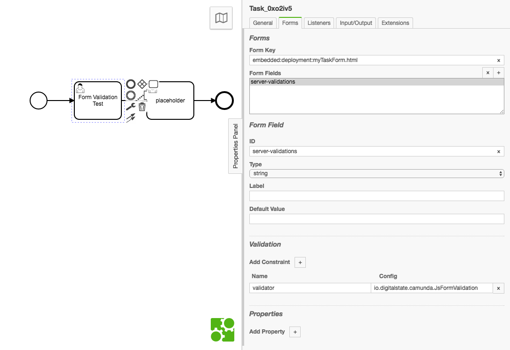
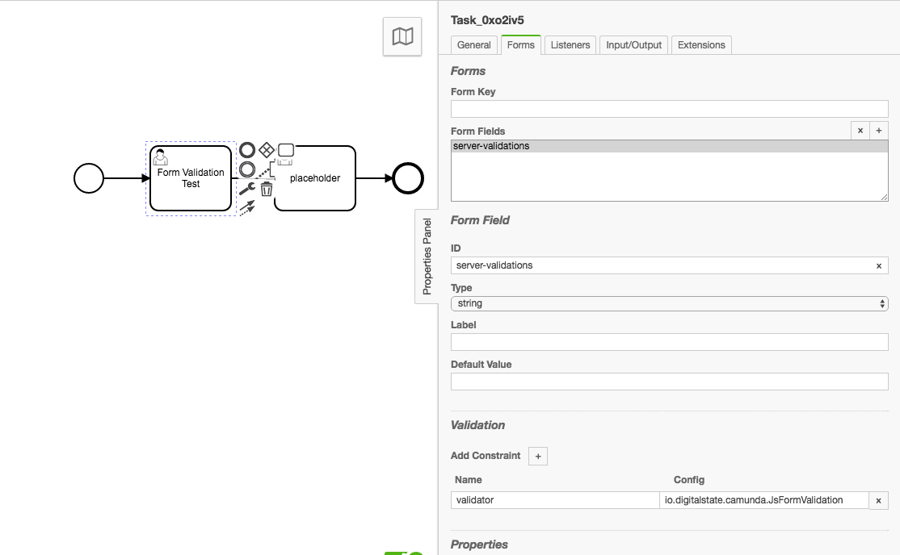
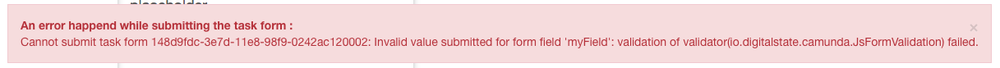

# Camunda Javascript (Nashorn) Form Validation (Server Side)

The following enables server side validation of form submissions for Start Events and User Tasks.

validation is enabled through the Java ScriptEngine service using the Nashorn engine.

## Why does this need to exist?

Camunda provides the ability to generate Angular Forms for use with Tasklist, but you cannot generate custom Server side validations on a per process definition basis.  This is a problem because we typically want to create more complex validations that should be enforced on the server side, and there may be validations that need to occur with a third-party (such as a web service) that would be a Server to Server communication.

This solution provides a very easy to use example of validation that can scale for simple and extremely complex validation scenarios.

The solution also provides the ability to enable better Server to Service / System to System interactions, where a API Contract can be established (maybe through Swagger...) and that contract is enforced on a Start Event and User Task basis.

# Usage

1. Add the jar to the Camunda classpath.

1. In Camunda Modeler configure a Start Event or User Task with the following:
    1. In the Form tab, add a `Form Field` with the `+` button.
    
    1. Set the `id` to something meaningfull such as "server-validations".  This id will be shown on the UI of Camunda Tasklist when a validation error is thrown:
    
        > An error happend while submitting the task form :
        > Cannot submit task form 148d9fdc-3e7d-11e8-98f9-0242ac120002: Invalid value submitted for form field 'server-validations': validation of validator(io.digitalstate.camunda.JsFormValidation) failed.

        You will be able to see the specific errors in the console:
        > Caused by: org.camunda.bpm.engine.impl.form.validator.FormFieldValidationException: firstName is required

        or

        >  Caused by: org.camunda.bpm.engine.impl.form.validator.FormFieldValidationException: age must be 18 or older

        While error messages are supported at the Java API level, the messages are not currently propogated to the Camunda REST API as per JIRA issue: [CAM-8276](https://app.camunda.com/jira/browse/CAM-8276).
        
        Further history on this issue can be found at [Github Issue/PR: 195](https://github.com/camunda/camunda-bpm-platform/pull/195/) and Jira [CAM-2757](https://app.camunda.com/jira/browse/CAM-2757)
    
    1. Set the "type" value to String.  It can be any type as we are only using this field are a marker to inject our validator.

    1. Label and default value can be left null/blank as they are unused.

    1. In the Validation section add a "Constraint" with the `+` button with the following configuration:
    
        **Name**: `validator`
        
        **Config**: `io.digitalstate.camunda.JsFormValidation`

    1. You can also set a Form Key value for using a Embedded Form.  Note that when you configure your Embedded Form / Angular Form code/html, you will still need to preform the above configurations to enable the custom server validation.

1. Deploy your BPMN file, and as part of the deployment include a file called `form-validation.js`.  This javascript file will be what is executed during validation.  See `./bpmn/form-validation.js` for a working example and usage.

The `form-validation.js` file must be included in every deployment as the validator will use the current execution context to get the file from the deployment resources.


> **NOTE**: See the `docker` folder for a ready to use example with docker-compose.  Run: `docker-compose up` from within the docker folder, and then deploy the files in the `bpmn` folder, and go to `localhost:8080/camunda` and access the Tasklist (username: `demo` password: `demo`)


## Camunda API Usage

POST: `localhost:8080/engine-rest/process-definition/key/js-form-validation-test-1/submit-form`

with a JSON payload of:

```json
{
	"variables":
	    {
	    	"age": {"value": 19, "type": "Integer"} 
	    } 
}
```

Currently a failed validation will return a Server code error 500 with the following style of response:

```json
{
    "type": "RestException",
    "message": "Cannot instantiate process definition 984a61c6-3f38-11e8-9aa3-0242ac130002: Invalid value submitted for form field 'server_validation': validation of validator(io.digitalstate.camunda.JsFormValidation) failed."
}
```

This response is due to a lack of REST API support for form validation errors as per: [CAM-8276](https://app.camunda.com/jira/browse/CAM-8276)

The console will print:

```console

...

camunda_1  | Caused by: org.camunda.bpm.engine.impl.form.validator.FormFieldValidationException: {"age":["Age must be greater than 18"]}
camunda_1  | 	at io.digitalstate.camunda.JsFormValidation.validate(JsFormValidation.java:71)
camunda_1  | 	at org.camunda.bpm.engine.impl.form.validator.FormFieldValidatorInvocation.invoke(FormFieldValidatorInvocation.java:35)
camunda_1  | 	at org.camunda.bpm.engine.impl.delegate.DelegateInvocation.proceed(DelegateInvocation.java:54)
camunda_1  | 	at org.camunda.bpm.engine.impl.delegate.DefaultDelegateInterceptor.handleInvocationInContext(DefaultDelegateInterceptor.java:87)
camunda_1  | 	at org.camunda.bpm.engine.impl.delegate.DefaultDelegateInterceptor.handleInvocation(DefaultDelegateInterceptor.java:59)
camunda_1  | 	at org.camunda.bpm.engine.impl.form.validator.DelegateFormFieldValidator.doValidate(DelegateFormFieldValidator.java:107)
camunda_1  | 	at org.camunda.bpm.engine.impl.form.validator.DelegateFormFieldValidator.validate(DelegateFormFieldValidator.java:65)
camunda_1  | 	at org.camunda.bpm.engine.impl.form.handler.FormFieldValidationConstraintHandler.validate(FormFieldValidationConstraintHandler.java:47)
camunda_1  | 	... 102 more

... 

```

Where the first line is the failed validation(s)

```console
camunda_1  | Caused by: org.camunda.bpm.engine.impl.form.validator.FormFieldValidationException: {"age":["Age must be greater than 18"]}
```

## Validate.js usage

in the form-validation.js there is usage examples of validate.js.  Validate.js is used because Nashorn Javascript engine can load the libary without issues.

A simple example is:

```js
// Validate.js Constraints
function getConstraints() {
  var constraints = {
    age: {
      presence: true,
      numericality: {
        onlyInteger: true,
        greaterThan: 18,
        lessThanOrEqualTo: 125,
      }
    }
  };
  return constraints
}

var validation = validate(jsonSubmission, getConstraints())

if (validation === undefined) {
  validationResult(true)
} else {
  validationResult(false, {
                            "detail": "VALIDATE.JS", 
                            "message": JSON.stringify(validation)
                          }
                    )
}
```

A valid validation will return `undefined` and anything that is not a valid issue will return a object of keys that represent each field name.

see https://validatejs.org for further examples.

### load() for validation functions

The Nashorn `load()` function can also take a http url.  So you can store validations on a web server and load specific validations constraints as required based on your logic.  Be aware that this will create increase response time of your submission.

## Screenshots

### BPMN



### Camunda Modeler






### Task List with Error message:




# Example Validation Errors

> 12-Apr-2018 13:37:17.817 WARNING [http-nio-8080-exec-9] org.camunda.bpm.engine.rest.exception.RestExceptionHandler.toResponse org.camunda.bpm.engine.rest.exception.RestException: Cannot submit task form 209c9407-3e78-11e8-98f9-0242ac120002: Invalid value submitted for form field 'myField': validation of validator(io.digitalstate.camunda.JsFormValidation) failed.

> Caused by: org.camunda.bpm.engine.impl.form.validator.FormFieldValidatorException: Invalid value submitted for form field 'myField': validation of validator(io.digitalstate.camunda.JsFormValidation) failed.

> Caused by: org.camunda.bpm.engine.impl.form.validator.FormFieldValidationException: Field ABC123 is Required!!!

> Caused by: org.camunda.bpm.engine.impl.form.validator.FormFieldValidationException: firstName is required

> Caused by: org.camunda.bpm.engine.impl.form.validator.FormFieldValidationException: age must be 18 or older

# Example Success

In console:

``` console
camunda_1  | Submission Values:
camunda_1  | {
camunda_1  |   firstName => Value 'John' of type 'PrimitiveValueType[string]'
camunda_1  |   myField => Value 'BLah!' of type 'PrimitiveValueType[string]'
camunda_1  |   age => Value '18' of type 'PrimitiveValueType[long]'
camunda_1  | }
camunda_1  | VALIDATION RESULT: true
camunda_1  | Validation Passed!!!
```


# form-validation.js notes

## Variables (Bindings)

The form-validation.js is a javascript file that will executed in a Nashorn engine context.

The `Execution` and submission values have been binded to this engine context.

`execution` : returns `org.camunda.bpm.engine.impl.persistence.entity.ExecutionEntity`, which is the typical "execution" variable that is used in Camunda scripting scenarios.

`submissionValues` : returns: Returns `org.camunda.bpm.engine.variable.impl.VariableMapImpl`, which is a typical Java Map with all of the submission values.  This can be navigated using Java and Javascript style APIs.  see the form-validation.js file for usage examples.

### Submission Values

Submission Values are a Map and can be accessed with more detailed APIs:

submissionValues variable can be accessed as a Map/HashMap and with extra helpers from nashron:

`submissionValues['myFieldName']` -> returns the value of the field myFieldName
`submissionValues.toString()` -> pretty prints a detailed breakdown of the Map such as:

```console
{
  myField => Value 'STEPHEN!!!' of type 'PrimitiveValueType[string]'
}
```

See the following reference material for more API usage:

References:
1. https://github.com/camunda/camunda-commons/blob/master/typed-values/src/main/java/org/camunda/bpm/engine/variable/impl/VariableMapImpl.java
2. https://wiki.openjdk.java.net/display/Nashorn/Nashorn+extensions see: "Java Map keys as properties" section
3. https://github.com/camunda/camunda-commons/blob/master/typed-values/src/main/java/org/camunda/bpm/engine/variable/impl/VariableMapImpl.java


## Script Errors

ScriptErrors will be caught and returned to the console:

> Caused by: org.camunda.bpm.engine.impl.form.validator.FormFieldValidationException: SCRIPT ERROR Occured: javax.script.ScriptException: TypeError: submissionValues.entrySet().get is not a function in <eval> at line number 12

Where line 12 is where the specific error occurred in the form-validation.js script.

## validateData() function

The `validateData()` function is a helper function to prepare the validation result that will be returned to the Camunda engine as a "true, false, or Throw Validation Exception".

The validateData function is imported from the `validationResult.js` file that is loaded through `load('classpath:validationResult.js')` which can be seen in the form-validation.js file.

Usage example:

```js
// Indicates that the validation was valid / no errors
validationResult(true)

// or 

// Indicates that the validation was unsuccessful / there was at least 1 error found
validationResult(false, {
                           "detail": "FIELD_REQUIRED", 
                           "message": "Field ABC123 is Required!!!"
                         }
                   )
```

This would typically be called by a higher level library such as Validate.js or a custom function such as:

```js
function validateData(values){
  if (values.containsKey('firstName') == false){
    return validationResult(false, {
                                     "detail": "FIELD_REQUIRED", 
                                     "message": "firstName is required"
                                    })
  }

  if (values.containsKey('age') && values['age'] < 18 ){
    return validationResult(false, {
                                     "detail": "AGE_LIMIT", 
                                     "message": "age must be 18 or older"
                                    })
  }
}
```

See the form-validation.js example file for further usage examples.


# TODO

1. Cleanup Messages in console for proper Camunda Logging usage
1. Add Bean support for calling the validator through a Expression/Short name, rather than the fully qualified class name.
1. Add SPIN support and usage examples
1. <s>Add validate.js example</s>
1. Better error and debug support
1. Add error messages in the REST API and Task list for Camunda
1. Add Unit Testing
1. Add to Maven and easy importing into camunda Maven builds
1. Add usage example of Form Validation occuring from a Vertx Event Bus (Polyglot)
1. Update Camunda Docs with notes and usage of the Form Validation Error Messages that can be thrown: https://docs.camunda.org/manual/7.8/user-guide/task-forms/#form-field-validation.  Docs currently are missing this information.
1. Add support for multiple validation js files in a deployment and each Start Event / User Task can call a specific validation js file (likely through expression arguments or Form Properties)
1. Add example of Web Service Validation call, where data is validated against a web service, and the web service call is done from Camunda Server side to the third-party.