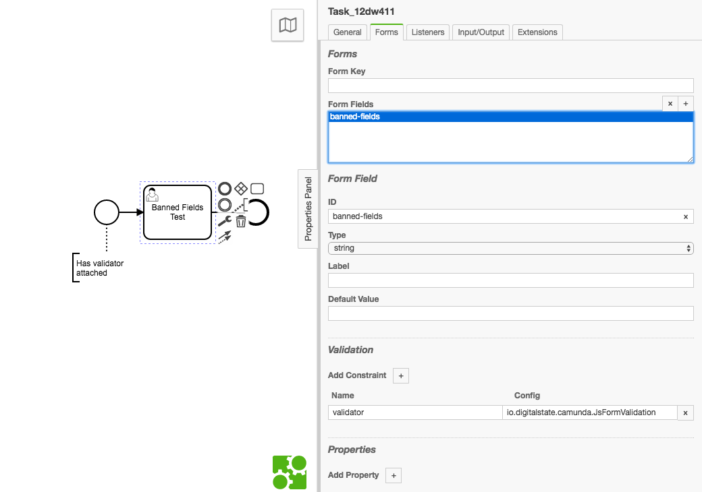

# Banned Fields Example

This is a example of banned fields

## Banned Field configuration screenshot

In this screenshot we have a `banned-fields.js` that was part of the deployment.  The field property (`validator_file`) does not need to be set because the field name (`banned-fields`) is the same as our javascript file (`banned-field.js`).




## Task Completion

Given the following API usage

**POST**: `camunda:8080/engine-rest/task/df4fe4ec-4336-11e8-b611-0242ac130002/submit-form`

Where `df4fe4ec-4336-11e8-b611-0242ac130002` is the Task Id.

and a JSON body in the POST of:

**Body**:

```json
{
    "variables": {
        "age": {
            "value": 25,
            "type": "Integer"
        },
        "priority": {
            "value": 10,
            "type": "Integer"
        }
    }
}
```

we are attempting to update the Age field and the priority field, but the priority field is a "banned field" and will throw a validation error.

# Sample Response

Rest API response:

```json
{
    "type": "RestException",
    "message": "Cannot submit task form df4fe4ec-4336-11e8-b611-0242ac130002: Invalid value submitted for form field 'banned-fields': validation of validator(io.digitalstate.camunda.JsFormValidation) failed."
}
```


Console response:

```console
Caused by: org.camunda.bpm.engine.impl.form.validator.FormFieldValidationException: Submission contains a banned field: ["risk","owner","master_field","current_state","flagged","priority"]
```

# banned-fields.js

```js
load('classpath:validationResult.js')
load('classpath:validate.min.js')
var JSONObject = Java.type('org.camunda.bpm.engine.impl.util.json.JSONObject')

var jsonSubmission = JSON.parse(new JSONObject(submissionValues).toString())

// Validate.js Constraints
function getConstraints() {
  var constraints = {
    age: {
      presence: true,
      numericality: {
        onlyInteger: true,
        greaterThan: 18,
        lessThanOrEqualTo: 125,
      }
    }
  };
  return constraints
}

// List of fields that are not allowed to be changed
function bannedFields(){
  // could also be loaded from another location (like a yaml or json file)
  return [
    "risk",
    "owner",
    "master_field",
    "current_state",
    "flagged",
    "priority"
  ]
}

// Check if the submission has any of the banned fields
function checkForBannedFields(submission, bannedFields) {
  // Loop through list of banned fields (nashorn loop)
  for each (var field in bannedFields){
    var hasBannedField = validate.contains(submission, field)
    // if a banned field was found then return true:
    if (hasBannedField == true) {
      return true
    }
  }
  // If no banned fields were found:
  return false
}

// if there is a banned field:
if (checkForBannedFields(jsonSubmission, bannedFields())){
  validationResult(false, {
                          "detail": "VALIDATE.JS", 
                          "message": 'Submission contains a banned field: ' + JSON.stringify(bannedFields())
                        }
                  )

// If no banned fields were found:
} else {
  // If no banned fields then continue:
  // Run Validations against Validate.js
  var validation = validate(jsonSubmission, getConstraints())

  if (validation === undefined) {
    validationResult(true)
  } else {
    validationResult(false, {
                              "detail": "VALIDATE.JS", 
                              "message": JSON.stringify(validation)
                            }
                      )
  }
}

```